# Execution Plan - 테이블오더 서비스

## Detailed Analysis Summary

### Change Impact Assessment
- **User-facing changes**: Yes - 고객용/관리자용 두 가지 UI 신규 개발
- **Structural changes**: Yes - 전체 시스템 아키텍처 신규 설계 (FastAPI + React + SQLite)
- **Data model changes**: Yes - 9개 Entity 신규 설계 (Store, Admin, Table, TableSession, Category, Menu, Order, OrderItem, OrderHistory)
- **API changes**: Yes - REST API 전체 신규 설계 + SSE endpoint
- **NFR impact**: Yes - JWT 인증, SSE 실시간 통신, 이미지 업로드, Docker 배포

### Risk Assessment
- **Risk Level**: Medium
- **Rollback Complexity**: Easy (Greenfield - 롤백 불필요)
- **Testing Complexity**: Moderate (SSE 실시간 테스트, 세션 관리 테스트 필요)

---

## Workflow Visualization

```mermaid
flowchart TD
    Start(["User Request"])
    
    subgraph INCEPTION["INCEPTION PHASE"]
        WD["Workspace Detection<br/>COMPLETED"]
        RA["Requirements Analysis<br/>COMPLETED"]
        US["User Stories<br/>COMPLETED"]
        WP["Workflow Planning<br/>COMPLETED"]
        AD["Application Design<br/>EXECUTE"]
        UG["Units Generation<br/>EXECUTE"]
    end
    
    subgraph CONSTRUCTION["CONSTRUCTION PHASE"]
        FD["Functional Design<br/>EXECUTE"]
        NFRA["NFR Requirements<br/>EXECUTE"]
        NFRD["NFR Design<br/>EXECUTE"]
        ID["Infrastructure Design<br/>EXECUTE"]
        CG["Code Generation<br/>EXECUTE"]
        BT["Build and Test<br/>EXECUTE"]
    end
    
    Start --> WD
    WD --> RA
    RA --> US
    US --> WP
    WP --> AD
    AD --> UG
    UG --> FD
    FD --> NFRA
    NFRA --> NFRD
    NFRD --> ID
    ID --> CG
    CG --> BT
    BT --> End(["Complete"])

    style WD fill:#4CAF50,stroke:#1B5E20,stroke-width:3px,color:#fff
    style RA fill:#4CAF50,stroke:#1B5E20,stroke-width:3px,color:#fff
    style US fill:#4CAF50,stroke:#1B5E20,stroke-width:3px,color:#fff
    style WP fill:#4CAF50,stroke:#1B5E20,stroke-width:3px,color:#fff
    style AD fill:#FFA726,stroke:#E65100,stroke-width:3px,stroke-dasharray: 5 5,color:#000
    style UG fill:#FFA726,stroke:#E65100,stroke-width:3px,stroke-dasharray: 5 5,color:#000
    style FD fill:#FFA726,stroke:#E65100,stroke-width:3px,stroke-dasharray: 5 5,color:#000
    style NFRA fill:#FFA726,stroke:#E65100,stroke-width:3px,stroke-dasharray: 5 5,color:#000
    style NFRD fill:#FFA726,stroke:#E65100,stroke-width:3px,stroke-dasharray: 5 5,color:#000
    style ID fill:#FFA726,stroke:#E65100,stroke-width:3px,stroke-dasharray: 5 5,color:#000
    style CG fill:#4CAF50,stroke:#1B5E20,stroke-width:3px,color:#fff
    style BT fill:#4CAF50,stroke:#1B5E20,stroke-width:3px,color:#fff
    style Start fill:#CE93D8,stroke:#6A1B9A,stroke-width:3px,color:#000
    style End fill:#CE93D8,stroke:#6A1B9A,stroke-width:3px,color:#000
    style INCEPTION fill:#BBDEFB,stroke:#1565C0,stroke-width:3px,color:#000
    style CONSTRUCTION fill:#C8E6C9,stroke:#2E7D32,stroke-width:3px,color:#000
    
    linkStyle default stroke:#333,stroke-width:2px
```

Text Alternative:
- INCEPTION: Workspace Detection (COMPLETED) -> Requirements Analysis (COMPLETED) -> User Stories (COMPLETED) -> Workflow Planning (COMPLETED) -> Application Design (EXECUTE) -> Units Generation (EXECUTE)
- CONSTRUCTION: Functional Design (EXECUTE) -> NFR Requirements (EXECUTE) -> NFR Design (EXECUTE) -> Infrastructure Design (EXECUTE) -> Code Generation (EXECUTE) -> Build and Test (EXECUTE)

---

## Phases to Execute

### INCEPTION PHASE
- [x] Workspace Detection (COMPLETED)
- [x] Requirements Analysis (COMPLETED)
- [x] User Stories (COMPLETED)
- [x] Workflow Planning (COMPLETED)
- [ ] Application Design - EXECUTE
  - **Rationale**: 새로운 컴포넌트/서비스 설계 필요. Backend API 구조, Frontend 컴포넌트 구조, 서비스 레이어 설계가 필요함.
- [ ] Units Generation - EXECUTE
  - **Rationale**: 시스템이 Backend + Frontend(고객/관리자)로 구성되어 다중 unit 분해가 필요함.

### CONSTRUCTION PHASE (per-unit)
- [ ] Functional Design - EXECUTE
  - **Rationale**: 9개 Entity 데이터 모델, 주문 상태 전이 로직, 세션 관리 비즈니스 규칙 등 상세 설계 필요.
- [ ] NFR Requirements - EXECUTE
  - **Rationale**: JWT 인증, SSE 실시간 통신, 이미지 업로드, bcrypt 해싱 등 NFR 요구사항 존재.
- [ ] NFR Design - EXECUTE
  - **Rationale**: NFR Requirements에서 도출된 패턴을 설계에 반영 필요.
- [ ] Infrastructure Design - EXECUTE
  - **Rationale**: Docker Compose 기반 배포 환경 설계 필요.
- [ ] Code Generation - EXECUTE (ALWAYS)
  - **Rationale**: 구현 필수.
- [ ] Build and Test - EXECUTE (ALWAYS)
  - **Rationale**: 빌드 및 테스트 지침 필수.

### OPERATIONS PHASE
- [ ] Operations - PLACEHOLDER

---

## Success Criteria
- **Primary Goal**: 고객이 테이블에서 메뉴를 주문하고, 관리자가 실시간으로 주문을 모니터링/관리할 수 있는 MVP 완성
- **Key Deliverables**: FastAPI Backend, React Frontend (고객/관리자), SQLite DB, Docker Compose 설정
- **Quality Gates**: 모든 User Story의 Acceptance Criteria 충족, SSE 실시간 통신 2초 이내
